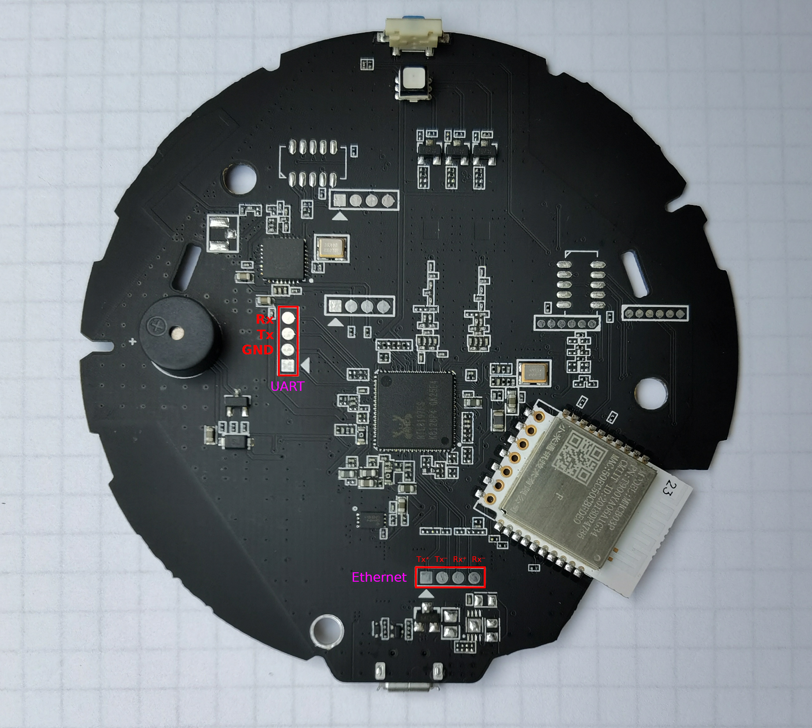

# Ethernet port on Xiaomi Gateway v3

## Ethernet DIY
| Xiaomi Gateway v3 | HR911105a Ethernet |
|:---:|:-----:|
| TX+ | Pin 1 |
| TX- | Pin 2 |
| RX+ | Pin 3 |
| RX- | Pin 6 |
| GND | Pin 8 |



## Ethernet Configuration

The Xiaomi Gateway v3 firmware constantly monitors wifi status by running `/bin/daemon_app.sh`.
This script checks if wifi is running, and if it's not running it will restart all the wifi configuration from scratch, which will cause ethernet-wifi bridging issues, flooding your network with packets.
The only way to prevent the firmware from restarting wifi is by launching two never-ending scripts that will prevent the wifi from being restarted.
This works because `/bin/daemon_app.sh` and `/bin/wifi_check.sh` check if these scripts are already running before starting them:
```
if [ "`ps -ww | grep wifi_check.sh | grep -v grep`xx" == "xx" ]
then
    wifi_check.sh
fi
```
```
if [ "`ps -w | grep wifi_start.sh | grep -v grep`xx" == "xx" ]
then
    wifi_start.sh
fi
```

### Firmware 1.4.7_0065

1. Copy `wifi_check.sh` and `wifi_start.sh` to `/data`.
2. Add `/data/wifi_check.sh &` to `run.sh`:
```
#!/bin/sh
/data/wifi_check.sh &
```
3. Reboot your gateway (wlan0 should be disabled and eth0 should be enabled).
